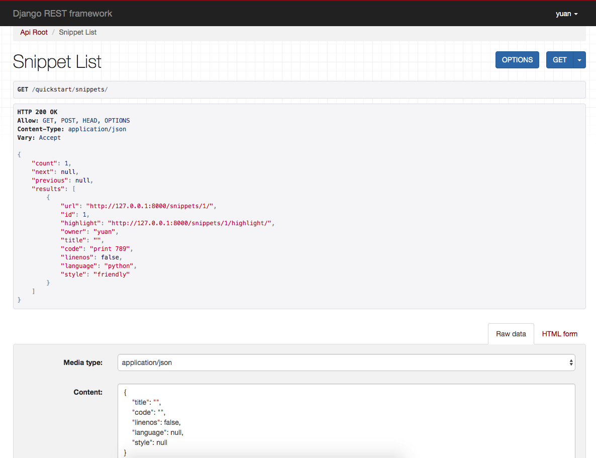
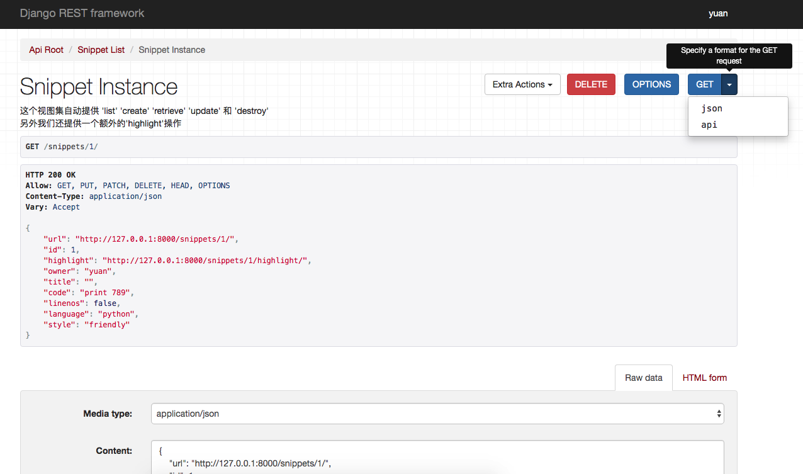
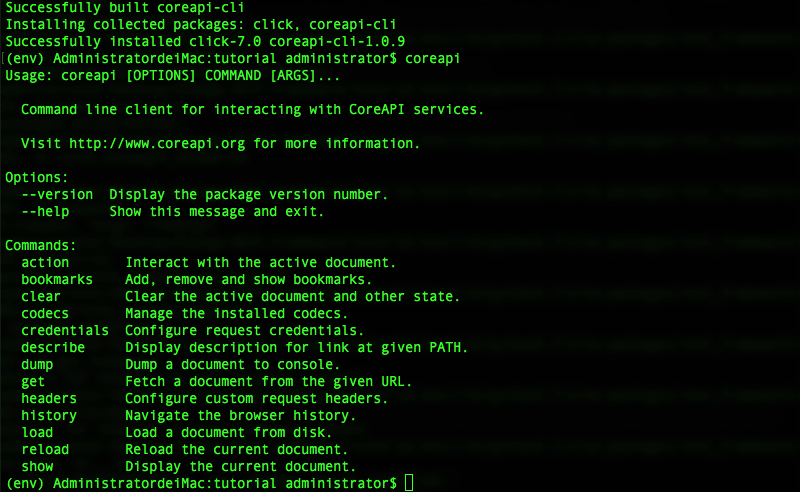

* [1. 关系和超链接 API（Relationships & hyperlinked APIs）](#1)
* [2. 视图集合和路由（ViewSets ＆ Routers）](#2)
* [3. 架构和客户端库(Schemas & client libraries)](#3)

<h3 id='1'></h3>

# 1. 关系和超级链接API

目前我们的API中的关系的通过主键来表示。我们下面将改进API的内聚力和可现性，而不是使用超链接来进来进行关系。

## 为我们的API的根地址创建端点
现在我们有`snippets`和`users`的端点，但是我们没有一个指向我们API的入口。我们需要创建一个，我们将使用基于函数的常规视图和我们前面介绍的@api_view装饰器。在你的quickstart/view.py中添加：

```
# quickstart/view.py

from rest_framework.decorators import api_view
from rest_framework.response import Response
from rest_framework.reverse import reverse


@api_view(['GET'])
def api_root(request, format=None):
    return Response({
        'users' : reverse('user-list', request=request, format=format),
        'snippets': reverse('snippet-list', request=request, format=format)
    })
```
> 这里应该注意两件事，首先我们使用`REST framework`和`reverse`函数来返回完全限定的URL；
> 其次，URL模式通过我们下面的`quickstart/urls.py`中声明的便利名称进行表示。

## 为高亮显示snippets创建端点

另一个明显的事情是我们的pastebin API仍然缺少高亮的显示代码端点。

与其他API端点不同，我们不想使用JSON，而是只呈现HTML表示。REST framework提供了两种HTML渲染器，一种是使用模板来处理渲染HTML，另一种渲染器是我们要用于此端点的渲染器。

在创建代码高亮显示视图时候，我们需要考虑的另一件事是：不存在我们可以使用的通用视图。我们不是返回一个对象实例，而是返回宇哥对象实例属性。

我们将使用基类来表示实例，并创建我们自己的`.get()`方法，而不是使用具体的通用视图。在你的quickstart/view.py中添加：

```
# quickstart/view.py

from rest_framework import permissions, renderers

class SnippetHighlight(generics.GenericAPIView):
    queryset = Snippet.objects.all()
    renderer_classes = (renderers.StaticHTMLRenderer,)

    def get(self, request, *args, **kwargs):
        snippet = self.get_object()
        return Response(snippet.highlighted)

``` 

像往常一样，我们需要将我们新创建的视图添加到`URLconf`中，我们将在`quickstart/urls.py`中添加一个新的url模式：

	url('^$', api_root),

然后为高亮代码snippet添加一个url模式：

	 url('^snippets/(?P<pk>[0-9]+)/highlight/$',SnippetHighlight.as_view()),

## 为我们API加上超链接
处理实体之间的关系是我们Web API设计中更具挑战性的方面之一，这里有一些我们选择代表关系的不同方法：

* 使用主键
* 在实体之间使用超链接
* 在相关实体上使用唯一的标识字段
* 使用默认的字符串代表相关实体
* 将相关的实体嵌套在父代表中
* 一切其他自定义的表示

REST framework支持这些样式，并且可在正式或者反向关系中应用他们。或者通过自定义管理器（如通用外键）应用他们。

在这种情况下，我们希望在实体之间使用超链接样式，为了做到这一点，我们将修改我们的序列化器来扩展`HyperlinkedModelSerializer`，而不是现有的`ModelSerializer`。

`HyperLinkedModelSerializer`与`ModelSerializer`有一下区别：

* 它不包含id字段
* 它包含一个`url`字段，使用`HyperlinkedIdentityField` .
* 关系使用`HyperlinkedRelatedField`，而不是`PrimaryKeyRelatedField`。

我们可以轻松的重写现有的序列化器来使用超链接:

```
# quickstart/serialzers.py


from rest_framework import serializers
from .models import Snippet
from django.contrib.auth.models import User

class SnippetSerializer(serializers.HyperlinkedModelSerializer):
    owner = serializers.ReadOnlyField(source='owner.username')
    highlight = serializers.HyperlinkedIdentityField(view_name='snippet-highlight', format='html')

    class Meta:
        model = Snippet
        fields = ('url', 'id', 'highlight', 'owner', 'title', 'code', 'linenos', 'language', 'style')


class UserSerializer(serializers.HyperlinkedModelSerializer):
    snippets = serializers.HyperlinkedRelatedField(many=True, view_name='snippet-detail',read_only=True)

    class Meta:
        model = User
        fields = ('url', 'id', 'username', 'snippets')

```
> 注意，我们还新添加了一个新的`highlight`字段。该字段的`url`字段类型相同，不同之处在于它指向的是`snippet-highlight`url模式，而不是`snippet-detail`url模式。
> 
> 因为我们已经包含了格式后缀的Url。例如`.json`，我们还需要在`highlight`字段上指出，任何格式后缀的超链接返回都应该使用`.html`后缀。

## 确保我们的URL模式被命名
如果我们要有超链接的API，我们需要确保命名URL模式。我们看看我们需要命名的URL模式。

* 我们的API根地址是指`user-list`和`snippet-list`。
* 我们的snippet序列化器包含一个指向`snippet-highlight`的字段。
* 我们的user序列化器包含一个指向'snippet-list'的字段
* 我们的snippet和user序列化器包含`url`字段，默认情况下将指向`{model_name}-detail`,在这个例子中就是`snippet-detail`和`user-detail`。

我们将所有这些名称添加到我们的URLconf后，我们最后在`quickstart/urls.py`文件应该如下：

```
quickstart/urls.py

from django.conf.urls import url
from rest_framework.urlpatterns import format_suffix_patterns
from .views import SnippetList, SnippetDetail, UserList, UserDetail, api_root,SnippetHighlight
from django.conf.urls import include

urlpatterns = format_suffix_patterns([
    url('^api-auth/', include('rest_framework.urls')),
    url('^$',api_root),
    url('snippets/$',SnippetList.as_view(), name='snippet-list'),
    url('^snippets/(?P<pk>[0-9]+)/$', SnippetDetail.as_view(), name='snippet-detail'),
    url('^snippets/(?P<pk>[0-9])/highlight/$', SnippetHighlight.as_view(), name='snippet-highlight'),
    url('^users/$', UserList.as_view(), name='user-list'),
    url('^users/(?P<pk>[0-9]+)/$',view=UserDetail.as_view(), name='user-detail'),
])
```

## 添加分页
users和snippets的列表视图最终会返回很多实例，所以我们真的要确保结果进行分页。并允许API客户端遍历每个单独页面。
我们可以通过稍微修改`tutorial/setting.py`,文件来更改默认列表样式可以使用分页。添加一下设置：

```
# tutorial/setting.py

REST_FRAMEWORK = {
    'DEFAULT_PAGINATION_CLASS': 'rest_framework.pagination.PageNumberPagination',
    'PAGE_SIZE': 10
}
```
> 注意，REST framework中的所有设置都放在一个名为`REST——FRMEWORK`的字典中，这有助于他们与其他项目保持良好的分离。
>
>如果需要，我们也可以自定义分页的样式，但是这里，我们会一直使用默认。
## 浏览API

启动服务·

 	python manage.py runserver
 	
在浏览器输入`http://127.0.0.1:8000/quickstart/snippets/`,结果如下图所示：


>你还可以在 snippet 实例上看到 “highlight” 链接，这会带您跳转到代码高亮显示的 HTML 页面。
>还有url的链接

<h3 id='2'></h3>

#  2.视图集合和路由（ViewSets ＆ Routers）
REST framework 包括一个用于处理`ViewSets`的抽象，它允许开发人员集中精力对API的状态和交互进行建模，并保留URL结构，根据通用的约定自动处理。

`ViewSet`类与`View`类几乎相同。只是他们提供诸如`read`或`update`操作。而不提供诸如`GET`或则`PUT`等方法处理程序。

一个`ViewSet`类最后时刻只能绑定一组方法处理程序，当它被实例化为一组视图的时候，通常通过使用一个`Router`类来处理定义复杂的URL。

## 使用ViewSet重构
我们来看看当前的一组视图，并将它们重构为视图集。
首先让我们将`UserList`和`UserDetail`视图重构为单个`UserViewSet`。我们可以删除这两个视图，并用一个类替换它们：

```
# quickstart/view.py

from rest_framework import viewsets #新增导入

class UserViewSet(viewsets.ReadOnlyModelViewSet):
    # 这个视图集自动提供 list 和 detail 操作

    queryset = User.objects.all()
    serializer_class = UserSerializer
```
> 这里我们使用了`ReadOnlyModelViewSet`类来自动提供默认的”只读“操作。我们仍然像我们使用常规驶入时一样设置`queryset`和`serializer_class`属性，但是我们不需要为两个单独的类，提供相同的信息。

接下来我们将替换`SnippetList`,`SnippetDetail`和`SnippetHihtlight`视图类。我们可以删除这三个视图，并再次使用一个类去替换它们。

```
# quickstart/view.py

class SnippetViewSet(viewsets.ModelViewSet):

    """
    这个视图集自动提供 'list' 'create' 'retrieve' 'update' 和 'destroy'
    另外我们还提供一个额外的'highlight'操作
    """
    queryset = Snippet.objects.all()
    serializer_class = SnippetSerializer
    permission_classes = (permissions.IsAuthenticatedOrReadOnly, IsOwnerOrReadOnly,)

    @action(detail=True, renderers_classed = [renderers.StaticHTMLRenderer])
    def highlight(self, request, *args, **kwargs):
        snippet = self.get_object()
        return Response(snippet.highlighted)
    
    def perform_create(self, serializer):
        serializer.save(owner=self.request.user)
```
> 这次我们使用了`ModelViewSet`类来获得完整的默认读写操作集。
> 
> 注意，我们还使用了`@action`装饰器来创建一个名为`highlight`的自定义操作。这个装饰器可以用来添加任何不符合标准`create/update/delete`样式的自定义端点。
> 
> 使用`@action`装饰器的自定义操作默认会响应`GET`请求。如果我们想要响应`POST`请求的操作，我们可以使用`methods`参数。
> 
> 自定义操作的URL默认取决于方法名称本身。如果需要更改URL的构造方式，可以包含`url_path`作为装饰器的关键字参数。

## 明确地将ViewSet绑定到URL
当我们定义URLConf时，处理程序方法只能绑定到操作上。为了看看到底发生了什么，让我们首先从我们的ViewSets中明确地创建一组视图。

在`quickstart/urls.py`文件中，我们将`ViewSet`类绑定到一组具体视图中。

```
# quickstart/urls.py

from .views import api_root, SnippetViewSet, UserViewSet
from rest_framework import renderers

snippet_list = SnippetViewSet.as_view({
    'get': 'list',
    'post': 'create',
})

snippet_detail = SnippetViewSet.as_view({
    'get': 'retrieve',
    'put': 'update',
    'patch': 'partial_update',
    'delete': 'destroy',
})

snippet_highlight = SnippetViewSet.as_view({
    'get': 'highlight'
}, renderers_class=[renderers.StaticHTMLRenderer])

user_list = UserViewSet.as_view({
    'get': 'list'
})

user_detail = UserViewSet.as_view({
    'get': 'retrieve'
})
```
>注意我们是如何从每个`ViewSet`类创建多个视图，通过将HTTP方法绑定到每个视图所需的操作中。

现在我们已经将资源绑定到具体的视图中，我们可以像往常一样在URL conf中注册视图。

```
urlpatterns = format_suffix_patterns([
    url('^api-auth/', include('rest_framework.urls')),
    url('^$',api_root),
    url('snippets/$', snippet_list, name='snippet-list'),
    url('^snippets/(?P<pk>[0-9]+)/$', snippet_detail, name='snippet-detail'),
    url('^snippets/(?P<pk>[0-9])/highlight/$', snippet_highlight, name='snippet-highlight'),
    url('^users/$', user_list, name='user-list'),
    url('^users/(?P<pk>[0-9]+)/$', user_detail, name='user-detail'),
])
```

## 使用Routers
因为我们使用`ViewSet`类而不是`View`类，所以实际上我们不需要自己设计URL。将资源链接到视图和URL的约定可以使用`Router`类自动处理，我们需要做的就使用路由器注册相应的视图集，然后让他执行其余操作。

这里我们重写quickstart/urls.py文件：

```
# quickstart/urls.py

from django.conf.urls import include, url
from rest_framework.routers import DefaultRouter

# 创建路由器并注册我们的视图。
router = DefaultRouter()
router.register('snippets', views.SnippetViewSet)
router.register('users', views.UserViewSet)

# API url 现在有路由器自动确定
urlpatterns = [
    url('^', include(router.urls))
]
```
> 用路由器注册视图集类似于提供urlpattern.我们包括两个参数--视图的URL前缀和视图集本身。
> 
> 我们使用`DefaultRouter`类为我们自动创建了API根视图，所以我们现在可以从`views`模块中删除`api_root`方法。

## 视图与视图集之间的权衡

使用视图集可以是一个常用的抽象。它有助于确保URL约定在你的API中保存一致，最大限度地减少编写所需的代码量，并允许你专注于API提供的交互，而不是URL conf的细节。

这并不意味着它总是正确的做法。但是用基于类的视图而不是基于函数的视图的时候，也有类似的权衡考虑。使用视图集不像单独构建视图那样明确。

<h3 id='3'></h3>

#3. 概要和客户端库(Schemas & client libraries)

概要是一种机器可阅读文档，用于描述可用API路径，器URLS以及他们支持的操作。
高腰可以是自动生成文档的有用工具，也可以是用于驱动，可以与API进行交互的动态客户端库。

## Core API
为了提供概要支持REST框架使用[Core API](http://www.coreapi.org/).

CoreAPI是用于描述API的文档规范，它用于提供可用路径的内部表示形式和API公开的可能的交互。他可以用于服务器端或者客户端。

当使用服务端时候，Core API 允许支持API支持呈现范围广泛的概要或者超媒体格式。

当使用客户端时，核心API允许动态驱动的客户端库，它可以与任何公开受支持的概要或者超媒体格式的API交互。

## 添加概要
REST框架支持明确定义的概要视图或者自动生成概要。由于我们使用的是视图集和路由，我们可以简单地使用自动概要生成。
你需要安装`coreapi`，python包才能包含API概要。

	pip install coreapi

现在我们可以通过在url配置中包含一个主动生成的概要视图来为API添加概要。

```
# quickstart/urls.py

from rest_framework.schemas import get_schema_view

urlpatterns = [
    url('^schema/$', schema_view), #新增
    url('^', include(router.urls))
]

```

如果你在浏览器中访问API的根路径，那么你现在应该就可以看到`core json`表示形式是另一个可用选项。


我们也可以通过在`Accept`标识头中指定所需的内容类型从从命令行请求概要。

```
$ http http://127.0.0.1:8000/schema/ Accept:application/coreapi+json
HTTP/1.0 200 OK
Allow: GET, HEAD, OPTIONS
Content-Type: application/coreapi+json

{
    "_meta": {
        "title": "Pastebin API"
    },
    "_type": "document",
    ...
```
默认输入样式是使用Core JSON编码。
还支持其他概要格式，如Open API(以前叫Swagger)。

## 使用命令行客户端

现在我们的API暴露了一个概要路径，我们可以使用一个动态的客户端库与API进行交互，为了演示这个，我们使用CoreAPI命令行客户端。

命令行客户端作为一个`coreapi-cli`包提供：

	pip install coreapi-cli

现在检查他在命令行上是否可用...


首先我们使用命令行客户端加载API概要。

```
$ coreapi get http://127.0.0.1:8000/schema/
<Pastebin API "http://127.0.0.1:8000/schema/">
    snippets: {
        highlight(id)
        list()
        read(id)
    }
    users: {
        list()
        read(id)
    }
 ```
我们还没有认证，所以我们现在只能看到只读路径，这与我们设置的API权限是一致的。
我们使用命令行客户端，尝试列出现有代码片段：

```
$ coreapi action snippets list
[
    {
        "url": "http://127.0.0.1:8000/snippets/1/",
        "id": 1,
        "highlight": "http://127.0.0.1:8000/snippets/1/highlight/",
        "owner": "lucy",
        "title": "Example",
        "code": "print('hello, world!')",
        "linenos": true,
        "language": "python",
        "style": "friendly"
    },
    ...
```

一些API路径需要命名参数。例如，要获取特定代码片段的高亮HTML表示，我们需要提供一个id。

```
$ coreapi action snippets highlight --param id=1
<!DOCTYPE html PUBLIC "-//W3C//DTD HTML 4.01//EN" "http://www.w3.org/TR/html4/strict.dtd">

<html>
<head>
  <title>Example</title>
  ...
  
```

## 验证我们的客户端
如果我们想要创建，编辑，和删除代码片段，我们需要进行有效的用户身份验证，在这种情况下，我们只需要使用基本的auth。
请确保使用实际的用户名和密码替换下面的`<username>`和`<password>`.

```
$ coreapi credentials add 127.0.0.1 <username>:<password> --auth basic
Added credentials
127.0.0.1 "Basic <...>"
```

现在，如果我们再次提取概要，我么应该可以看到一组可用的交互。

```
$ coreapi reload
Pastebin API "http://127.0.0.1:8000/schema/">
    snippets: {
        create(code, [title], [linenos], [language], [style])
        delete(id)
        highlight(id)
        list()
        partial_update(id, [title], [code], [linenos], [language], [style])
        read(id)
        update(id, code, [title], [linenos], [language], [style])
    }
    users: {
        list()
        read(id)
    }
```

我们现在能够与这些路径行交互。例如，要创建一个新的代码片段:

```
$ coreapi action snippets create --param title="Example" --param code="print('hello, world')"
{
    "url": "http://127.0.0.1:8000/snippets/7/",
    "id": 7,
    "highlight": "http://127.0.0.1:8000/snippets/7/highlight/",
    "owner": "lucy",
    "title": "Example",
    "code": "print('hello, world')",
    "linenos": false,
    "language": "python",
    "style": "friendly"
}
```

然后删除一个代码片段：

	$ coreapi action snippets delete --param id=7

除了命令行客户端，开发人员还可以使用客户端库与你的API进行交互。Python客户端库是第一个可用的库，并且计划即将发布一个Javascript客户端库。

有关定制模式生成和使用Core API客户端库的更多详细信息，您需要参考完整的文档。