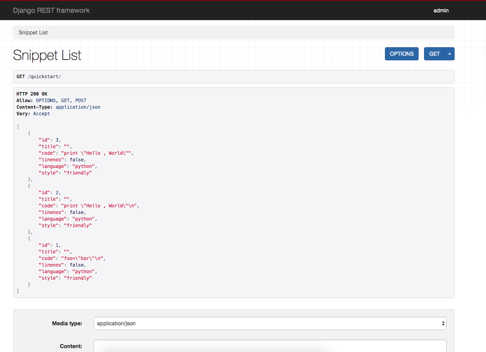
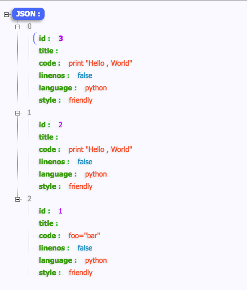
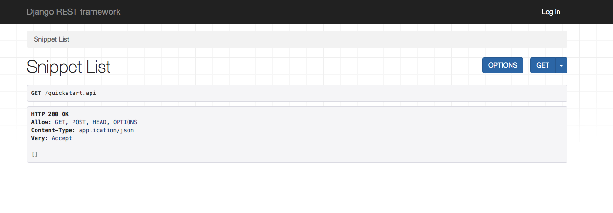
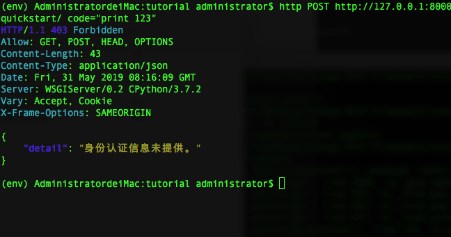

Django-REST-framework使用技巧(二)

* [1.请求和响应](#1)
* [2.基于类的视图](#2)
* [3.认证和权限](#3)

<h3 id='1'></h3>

# 1.请求和响应
从现在开始，我们将真正开始接触REST framework的核心。下面我们介绍几个基本的模块。


## 请求对象(request objects)
REST framework引入了一个扩展常规`HTTPRequest`和`Request`对象，并提供了更灵活的请求解析。`request`对象的核心功能是`request.data`属性，它与`request.POST`类似，但对于使用Web API更加有用。

> request.POST  #只处理表单数据。 只适用于'POST'方法
> 
> request.data  #处理任意数据。使用与'POST', 'PUT'和'PATCH'方法


## 响应对象（response object）
REST framework还引入了一个Response对象，该对象是一种获取未渲染内容的`TemplateResponse`类型，并使用内容协商来确定正确内容类型返回给客户端。
	
	reture  Response(data) # 渲染成客户端请求的内容类型

## 状态码
在你的视图中使用数字HTTP状态码，并不是总利于阅读，如果写错代码，很容易被忽略。REST framework为每个状态码提供更明确的标识符，例如Status模块中`HTTP_400_BAD_REQUEST`。

## 包装API视图（Wrapping API views）
REST framework提供了两种编写API视图的封装。

* 用于基于函数视图的@api_view装饰器
* 用于基于类视图的APIView类

这些视图封装提供了一些功能，例如确保你的视图能够接收`Request`实例，并将上下文添加到`Response`对象，使得内容协商可以正常的运行。

视图封装还内置了一些行为。例如在适当的时候返回`405 Method Not Allowed`响应，并处理访问错误的输入`request.data`时候出发任何`ParaseError`异常。

## 组合视图
我们不需要再`view.py`中JSONResponse类所以删掉，然后我们可以重构我们的视图。

```
# quickstart/view.py 

from django.http import HttpResponse,JsonResponse
from django.views.decorators.csrf import csrf_exempt
from rest_framework.parsers import JSONParser
from quickstart.models import Snippet
from quickstart.serializers import SnippetSerializer
from rest_framework.decorators import api_view #新增导入
from rest_framework.response import Response #新增导入
from rest_framework.status import HTTP_201_CREATED, HTTP_400_BAD_REQUEST, HTTP_404_NOT_FOUND,HTTP_204_NO_CONTENT  #新增导入

# @csrf_exempt # 删除
@api_view(['GET', 'POST']) #  新增
def snippet_list(request):
    # 列出所有代码 snippet， 或者创建一个新的snippet

    if request.method == 'GET':
        snippets = Snippet.objects.all()
        serializer = SnippetSerializer(snippets, many=True)
        # return JsonResponse(serializer.data, safe=False) # 删除
        return Response(serializer.data) # 新增
    elif request.method == 'POST':
        data = JSONParser().parse(request)
        serializer = SnippetSerializer(data=data)
        if serializer.is_valid():
            serializer.save()
            # return JsonResponse(serializer.data, status=201) # 删除
            return Response(serializer.data, status=HTTP_201_CREATED) # 新增

    # return JsonResponse(serializer.errors, status=400) # 删除
    return Response(serializer.errors, status=HTTP_400_BAD_REQUEST) # 新增
```
> 我们的实例视图比前面的示例有所改进。它稍微简洁一点，现在的代码与我们使用 Forms API 时非常相似。我们还使用了指定的状态码，这使得响应更加明显。

```
# @csrf_exempt # 删除
@api_view(['GET', 'PUT', 'DELETE']) #新增
def snippet_detail(request, pk):
    # 获取、更新或者删除一个代码 snippet

    try:
        snippet = Snippet.objects.get(pk=pk)
    except Snippet.DoesNotExist:
        # return HttpResponse(status=404) # 删除
        return Response(status=HTTP_404_NOT_FOUND)  #新增

    if request.method == 'GET':
        serializer = SnippetSerializer(snippet)
        # return JsonResponse(serializer.data) # 删除
        return Response(serializer.data)  #新增

    elif request.method == 'PUT':
        data = JSONParser().parse(request)
        serializer = SnippetSerializer(snippet, data=data)
        if serializer.is_valid():
            serializer.save()
            # return JsonResponse(serializer.data) # 删除
            return Response(serializer.data)  #新增
        # return JsonResponse(serializer.errors, status=400) # 删除
        return Response(serializer.errors, status=HTTP_400_BAD_REQUEST)  #新增

    elif request.method == 'DELETE':
        snippet.delete()
        # return HttpResponse(status=204) # 删除
        return Response(status=HTTP_204_NO_CONTENT)  #新增
```
> 这对我们来说应该都是非常熟悉的 - 它和正常 Django 视图并没有什么不同。
> 
> 注意，我们不再显式地将请求或响应绑定到给定的内容类型。request.data 可以处理传入的 json 请求，但它也可以处理其他格式。同样，我们返回带有数据的响应对象，但允许 REST framework 将响应渲染成正确的内容类型。

## 为我们的网址添加可选的格式后缀
为了利用我们的响应不再被硬链接到单个内容类型的事实。让我们将格式后缀的之处添加我们的API端点。使用格式后缀，欧文提供了明确的只想给定的格式URL，这意味着我们的API可以处理一些URLs，类似这样的格式：`http://example.con/api/items/4.json`.
像下面这样在这两个视图中添加一个`format`关键字参数。
	
	def snippet_list(request, format=None):
	def snippet_detail(request,pk, format=None):
	
现在更新quickstart/urls.py 文件，在现在的urls基础上追加一组`format_suffix_patterns`

```
# quickstart/urls.py

from django.conf.urls import url
from .views import snippet_list, snippet_detail
from rest_framework.urlpatterns import format_suffix_patterns #新增

urlpatterns = [
    url('^quickstart/$', snippet_list),
    url('^quickstart/(?P<pk>[0-9]+)/$', snippet_detail),
]

urlpatterns = format_suffix_patterns(urlpatterns) #新增
```
> 我们不一定需要添加额外的url模式。但他给我们一个简单、清晰的方式来引用特定的格式。

## 测试API
启动服务 python manage.py runserver

在浏览器中输入 `http://127.0.0.1:8000/quickstart/`，结果如下


在浏览器输入`http://127.0.0.1:8000/quickstart.api`,结果如下


在浏览器输入`http://127.0.0.1:8000/quickstart.json`,结果如下



### 可视化
由于API是基于客户端发起请求的选择来响应内容的格式，因此当接收到来之浏览器的请求是，会默认以HTML的格式来描述数据，这允许API返回网页完全可浏览的HTML。
有关可浏览的API功能以及如何对其进行定制更多的信息，可参考[可浏览的API](https://www.django-rest-framework.org/topics/browsable-api/)主题。


<h3 id='2'></h3>
# 2. 基于类的视图
我们也可以使用基于**类的视图**来编写API视图，而不是基于**函数**的视图。正如我们看到的，这个模式足够强大，可以让我们重用通用功能，并帮助我们保持代码[DRY](https://en.wikipedia.org/wiki/Don't_repeat_yourself)（Don't repeat yourself）

## 使用基于类的视图我们重写我们的API
我们首先将基于类的视图重写根视图。所有者写都涉及对view.py的修改。

```
# quickstart/view.py

class SnippetList(APIView):
    # 列出所有的代码snippet，或者创建一个新的snippet

    def get(self, request, format=None):
        snippets = Snippet.objects.all()
        serializer = SnippetSerializer(snippets, many=True)
        return Response(serializer.data)

    def post(self, request, format=None):
        serializer = SnippetSerializer(data=request.data)
        if serializer.is_valid():
            serializer.save()
            return Response(serializer.data, status=HTTP_201_CREATED)
        return Response(serializer.errors, status=HTTP_400_BAD_REQUEST)
```
> 这个看起来和以前的非常相似，但是我们在不同的HTTP方法之间有更好的分离，还需要更新`view.py`中的示例视图。

```
# quickstart/view.py

class SnippetDetail(APIView):
    # 获取、更新或者删除一个代码 snippet

    def get_object(self, pk):

        try:
            return Snippet.objects.get(pk=pk)
        except Snippet.DoesNotExist:
            raise HTTP_404_NOT_FOUND

    def get(self, request, pk, format=None):
        snippet = self.get_object(pk)
        serializer = SnippetSerializer(snippet)
        return Response(serializer.data)

    def put(self, request, pk, format=None):
        snippet = self.get_object(pk)
        serializer = SnippetSerializer(snippet, data=request.data)
        if serializer.is_valid():
            serializer.save()
            return Response(serializer.data)
        return Response(serializer.errors, status=HTTP_400_BAD_REQUEST)
    
    def delete(self, request, pk, format=None):
        snippet = self.get_object(pk)
        snippet.delete()
        return Response(status=HTTP_204_NO_CONTENT)
```
> 看起来，它仍然非常类似基于**函数**的视图

使用基于列的视图，我们现在还需要重构quickstart/urls.py文件内容：

```
from django.conf.urls import url
from rest_framework.urlpatterns import format_suffix_patterns
from .views import SnippetList, SnippetDetail

urlpatterns = [
    url('^quickstart/$', SnippetList.as_view()),
    url('^quickstart/(?P<pk>[0-9]+)/$', SnippetDetail.as_view()),
]

urlpatterns = format_suffix_patterns(urlpatterns)
```
> 重启服务，如果你没有搬错砖，一切应该和以前一样的。

##使用混合（mixins）

使用基于类的视图的优势之一，就是我们可以很容易撰写可重复的行为。
到目前为止，我们使用创建、获取、更新、删除操作和我们创建的任何基于模型的API视图非常相似。这些常见的行为是在REST framework的mixin类中实现的。

下面我们具体实践如何通过mixin类编写视图。在quickstart/view.py文件中：

```
from snippets.models import Snippet
from snippets.serializers import SnippetSerializer
from rest_framework import mixins
from rest_framework import generics


class SnippetList(mixins.ListModelMixin, mixins.CreateModelMixin, generics.GenericAPIView):

    queryset = Snippet.objects.all()
    serializer_class = SnippetSerializer

    def get(self, request, *args, **kwargs):
        return self.list(request, *args, **kwargs)

    def post(self, request, *args, **kwargs):
        return self.create(request, *args, **kwargs)
        
```
> 我们看一下这里都是什么意思:我们使用`GenericAPIView`构建视图,并且使用了`ListModelMixin`和`CreateModelMixin`.
> 基类提供核心功能,而mixin类提供`.list()`和`.create()`操作.让后我们可以明确的吧`get`和`post`绑定到适当的操作.

```
class SnippetDetail(mixins.RetrieveModelMixin,
                    mixins.UpdateModelMixin,
                    mixins.DestroyModelMixin,
                    generics.GenericAPIView):

    queryset = Snippet.objects.all()
    serializer_class = SnippetSerializer

    def get(self, request, *args, **kwargs):
        return self.retrieve(request, *args, **kwargs)

    def put(self, request, *args, **kwargs):
        return self.update(request, *args, **kwargs)

    def delete(self, request, *args, **kwargs):
        return self.destroy(request, *args, **kwargs)
```
> 这个和上面非常相似，我们再次使用`GenericAPIView`类来提供核心功能，并添加mixins来提供`.retrieve()`，`.update()`和`.destroy()`操作。
> 
> 从新运行服务，你会发现没有任何变化的。如果有，那就再运行一次。

## 使用通用的基于类的视图
我们使用mixin类，使用了比以前更少的代码重写了视图，但是我们可以更进一步。REST framework已经提供了一套已经混合的通用的视图。我们可以更加简化`view.py`模块。

```
from snippets.models import Snippet
from snippets.serializers import SnippetSerializer
from rest_framework import generics

class SnippetList(generics.ListCreateAPIView):
    queryset = Snippet.objects.all()
    serializer_class = SnippetSerializer
    
    
class SnippetDetail(generics.RetrieveUpdateDestroyAPIView):
    queryset = Snippet.objects.all()
    serializer_class = SnippetSerializer
```
> 刷新浏览器，你会发现没任何变化，如果有，老规矩：你搬错砖了


<h3 id='3'></h3>
# 3.认证和权限
目前，我们的api对谁都是开放的，谁都可以添加或者删除代码，没有任何隐私和限制，我们需要更高行为来确保：

* snippet代码始终与创建者关联
* 只有经过身份验证的用户才可以创建snippet
* 只有snippet的创建这个才可以更新或者删除它
* 未经身份验证的请求应具有只读的访问权限

## 将信息添加到我们的模型里面

我们对quickstart中的模块要再修改一下，首先要添加几个字段。其中一个字段将用于表示创建snippet代码关联的用户。
另外一个字段将用于存储高亮显示的，HTML内容表示的代码。
添加字段到quickstart/model.py文件中的Snippet模型中：

```
from django.db import models
from pygments.lexers import get_all_lexers
from pygments.styles import get_all_styles


# 提取出'pyment' 支持的所有语言的语法分析程序
LEXERS = [item for item in get_all_lexers() if item[1]]

# 提取除了'pyments' 支持的所有语言列表
LANGUAGE_CHOICES = sorted([(item[1][0], item[0]) for item in LEXERS])

# 提取出'pyment' 支持的所有格式化风格列表
STYLE_CHOICES = sorted((item, item) for item in get_all_styles())


class Snippet(models.Model):

    created = models.DateTimeField(auto_now_add=True)
    title = models.CharField(max_length=100, blank=True, default='')
    code = models.TextField()
    linenos = models.BooleanField(default=False)  # 是否显示行号
    language = models.CharField(choices=LANGUAGE_CHOICES, default='python', max_length=120)
    style = models.CharField(choices=STYLE_CHOICES, default='friendly', max_length=120)
    owner = models.ForeignKey('auth.User', related_name='snippets', on_delete=models.CASCADE) # 新增
    highlighted = models.TextField() #新增

    class Meta:
        ordering = ('-created',)

```
> 我们还需要确保在保存模型时候，使用pygments代码的高亮库来填充highlighted字段

我们需要导入额外模块，

```
from pygments.formatters.html import HtmlFormatter
from pygments import highlight
from pygments.lexers import get_lexer_by_name
```

然后再类中添加一个方法`.save()`

```
    def save(self, *args, **kwargs):
        # 使用 pygment 库创建一个高亮显示html表示的Snippet代码

        lexer = get_lexer_by_name(self.language)
        linenos = 'table' if self.linenos else False
        options = {'title': self.title} if self.title else {}
        formatter = HtmlFormatter(style=self.style, linenos=linenos, full=True, **options)
        self.highlighted = highlight(self.code, lexer, formatter)
        super(Snippet, self).save(*args, **kwargs)
```
做完这些工作，同创做法是会场街一个数据库迁移来实现这一点，但是现在让我们删掉数据库，重新开始。

```
(env) AdministratordeiMac:tutorial administrator$ ls
db.sqlite3	env		manage.py	quickstart  tutorial
(env) AdministratordeiMac:tutorial administrator$ rm -f db.sqlite3
(env) AdministratordeiMac:tutorial administrator$ rm -r quickstart/migrations

(env) AdministratordeiMac:tutorial administrator$ python manage.py makemigrations quickstart
(env) AdministratordeiMac:tutorial administrator$ python manage.py migrate quickstart
```

你可以创建几个不同的用户，用于测试不同的API，最快捷的方式就是`createsuperuser`命令。

	pyhton manage.py createsuperuser #然后按照提示填写用户名和密码就可以了

## 为我们的用户模型添加端点
我们现在有一些用户可以使用，我们最好将这些用户添加到我们的API中。创建一个新的序列化器，在`serializer.py`我呢间中添加：

```
# quickstart/serializer.py

from rest_framework import serializers
from .models import Snippet
from django.contrib.auth.models import User


class SnippetSerializer(serializers.ModelSerializer):

    class Meta:
        model = Snippet
        fields = ('id', 'title', 'code', 'linenos', 'language', 'style')


#新增
class UserSerializer(serializers.ModelSerializer): 

    snippets = serializers.PrimaryKeyRelatedField(many=True, queryset=Snippet.objects.all())

    class Meta:
        model = User
        fields = ('id', 'username', 'snippets')
```
> 由于`snippets`在用户模型上是反向关系，当使用`ModelSerializer`类时候，它将不会被默认包含，我们需要为他添加一个显式字段。


我们还会在`view.py`中添加几个视图。我们想要使用用户，表示只读视图，所以我们将使用`ListAPIView`和`RetrieveAPIView`通用的基于类的视图。

```
#quictstart/view.py

from rest_framework import generics
from .models import Snippet
from .serializers import SnippetSerializer, UserSerializer #新增导入
from django.contrib.auth.models import User


class SnippetList(generics.ListCreateAPIView):
    queryset = Snippet.objects.all()
    serializer_class = SnippetSerializer


class SnippetDetail(generics.RetrieveUpdateDestroyAPIView):
    queryset = Snippet.objects.all()
    serializer_class = SnippetSerializer

# 新增
class UserList(generics.ListAPIView):
    queryset = User.objects.all()
    serializer_class = UserSerializer
    
    
class UserDetail(generics.RetrieveAPIView):
    queryset = User.objects.all()
    serializer_class = UserSerializer
```  

最后我们需要通过URL conf中引用这些视图来将这些视图添加到API中，修改如下：

```
from django.conf.urls import url
from rest_framework.urlpatterns import format_suffix_patterns
from .views import SnippetList, SnippetDetail, UserList, UserDetail #新增导入

urlpatterns = [
    url('^quickstart/$', SnippetList.as_view()),
    url('^quickstart/(?P<pk>[0-9]+)/$', SnippetDetail.as_view()),
    url('^users/$',UserList.as_view()) # 新增
    url('users/(?P<pk>[0-9]+)/$', UserDetail.as_view()), # 新增
]

urlpatterns = format_suffix_patterns(urlpatterns)
```
## 将Snippets和用户关联
现在，如果我们创建了一个Snippet代码，那么无法将创建Snippet的用户与Snippet实例关联起来。用户不是作为序列化表示的一部分发送的，而是作为请求的属性传入。
我们处理方式是，在我们的Snippet视图上覆盖，`.perform_create()`方法，这中管理方式，允许我们修改实例保存，并处理传入请求，或者请求URL中隐含的任何信息。
在`SnippetList`视图类中添加一下方法：

```
class SnippetList(generics.ListCreateAPIView):
    queryset = Snippet.objects.all()
    serializer_class = SnippetSerializer
    
    # 新增
    def perform_create(self, serializer):
        serializer.save(owner=self.request.user)
```
> 现在我们的序列化器`create()`方法将被传递一个`owner`字段以及来自请求的验证数据。

## 更新序列化器
现在Snippet与创建他们的用户相关联了，让我们更新我们的`SnippetSerializer`以体现这一点。将下面内容添加到`serializers.py`文件中：

```
# quickstart/serializers.py

class SnippetSerializer(serializers.ModelSerializer):

    owner = serializers.ReadOnlyField(source='owner.username') # 新增

    class Meta:
        model = Snippet
        fields = ('id', 'title', 'code', 'linenos', 'language', 'style', 'owner')

```
> 注意：确保将`owner`添加到了内部的`Meta`类的字段列表中。
> 
> 这个字段中，`source`参数控制哪个属性用于填充字段，并且可以指向序列化实例的任何属性。它也可以采用如上所示的点符号(.),在这种情况下，他将与Django模板语言相似的方式遍历给定的属性。
> 
> 我们添加的字段是无类型的`ReadOnlyField`类，与其他类型的字段相反，如`CharField`,`BooleanField`等无类型的，但`ReadOnlyField`始终是只读的，只能用于序列化表示，但不能用于在反序列化实时更新模型实例。我们这里可以用`CharField(read_only=True)`.

## 添加视图所需的权限
现在，Snippet和用户相关联，我们希望确保只要经过身份认证的用户才能创建、更新、和删除snippets。
REST framework包含许多权限类，我们可以用来限制访问权限。在这种情况下，我们需要的是`IsAuthenticatedOrReadOnly`类，它将确保身份验证的请求获得读写访问权限。未经身份验证的请求获得只读访问权限。

在quickstart/view.py文件中，添加如下

```
# quickstart/view.py 

from rest_framework import permissions #新增


class SnippetList(generics.ListCreateAPIView):
    queryset = Snippet.objects.all()
    serializer_class = SnippetSerializer
    permission_classes = (permissions.IsAuthenticatedOrReadOnly,) #新增

    def perform_create(self, serializer):
        serializer.save(owner=self.request.user)


class SnippetDetail(generics.RetrieveUpdateDestroyAPIView):
    queryset = Snippet.objects.all()
    serializer_class = SnippetSerializer
    permission_classes = (permissions.IsAuthenticatedOrReadOnly,) #新增
```

## 增加查看API权限，添加登录

如果你现在打开浏览器，并导航到浏览器的到API，那么你将发现无法再创建新的snippet。因为需要增加权限。
我们可以通过编辑`url.py`文件中的URLconf来添加可浏览API的登录视图。
在文件顶部，我们导入：
	
		from django.conf.urls import include

并在文件末尾添加一个模式以包括可浏览的API的登录或者注销视图。

```
	urlpatterns = [
    url('^quickstart/$', SnippetList.as_view()),
    url('^quickstart/(?P<pk>[0-9]+)/$', SnippetDetail.as_view()),
    url('^users/$',UserList.as_view()),
    url('users/(?P<pk>[0-9]+)/$', UserDetail.as_view()),
    url('^api-auth/', include('rest_framework.urls')), # 新增
]
```
> 模式`api-auth/`部分实际上可以是你想使用的任何URL。

现在再次打开浏览器刷新页面，则会在右上角看到一个`登录`链接。如果你要用前面的创建用户登录，就可以再次创建snippets。如下图：

一旦创建了一些snippets后，导航到`/users/`端点，并注意到每个用户的`snippets`字段中包含与每个用户相关联的snippet id列表。

## 对象级权限

实际上我们希望所有人都可以看到snippets，但是只要创建snippet的用户才权限CRUD。
为此，我们需要创建一个自定义的权限。
在quickstart应用中，创建一个新的文件`permission.py`.

```
# quickstrat/permissions.py

from rest_framework import permissions

class IsOwnerOrReadOnly(permissions.BasePermission):
    # 自定义权限只允许队形的所有者去编辑它

    def has_object_permission(self, request, view, obj):
        # 读取权限被允许用于任何请求
        # 所以我们始终允许GET， HEAD 或者OPTIONS请求。

        if request.method in permissions.SAFE_METHODS:
            return True

        # 写入权限只允许给snippet的所有者
        return obj.owner == request.user
```
现在我们可以通过编辑`SnippetDetail`视图中的`permission_classes`属性将自定义权限添加到我们snippet实例中：

```
#  quickstart/view.py

from .permissions import IsOwnerOrReadOnly # 新增

class SnippetDetail(generics.RetrieveUpdateDestroyAPIView):
    queryset = Snippet.objects.all()
    serializer_class = SnippetSerializer
    permission_classes = (permissions.IsAuthenticatedOrReadOnly, IsOwnerOrReadOnly) # 新增


``` 
> 现在再次打开浏览器，你会发现"DELETE"和'PUT'操作只会出现在以创建者身份登录的snippet实例端点上。

## 使用API进行身份验证
因为现在我们在API上有一组权限，如果我们想要编辑任何snippet，我们需要先验证我们的请求。我们还没设置任何认证类，因此当前应用默认的`SessionAuthentication`和`BasicAuthentication`.

但我们通过web浏览器与API进行交互的时候，我们可以登录，然后浏览器会话将为请求提供所需的身份验证。

如果我们以百年城的方式与API进行交互，那么我们需要在每个请求上明确提供身份验证凭据。

如果我们尝试建立一个没身份验证的snippet，我们会得到一个错误:


我们可以通过添加之前的用户名和密码来发送成功请求：


>我们已经在我们的webAPI上获得了一套精细的权限组合，下一节**我们将介绍如何通过为高亮显示 snippet 创建 HTML 端点来将所有内容联结在一起，并通过对系统内的关系使用超链接来提高 API 的凝聚力。**