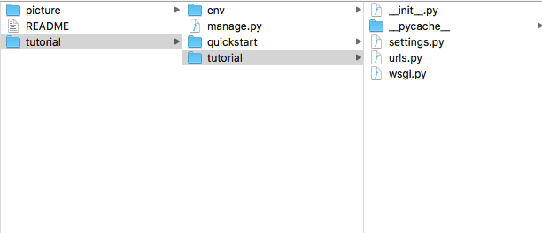
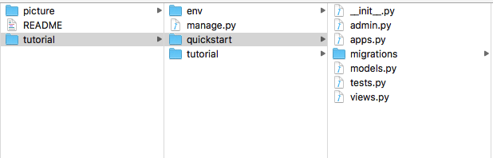
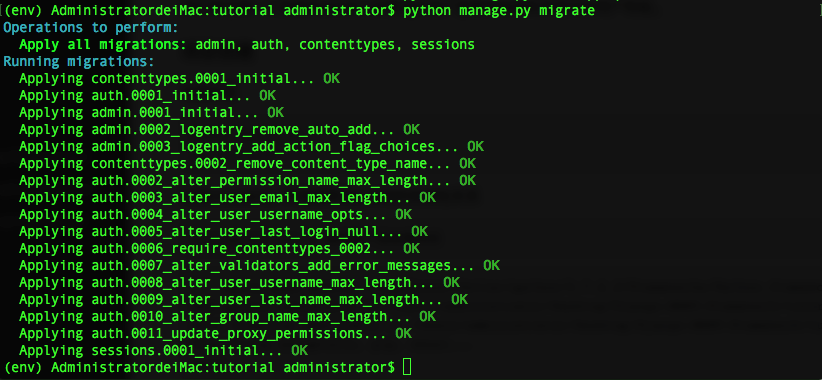
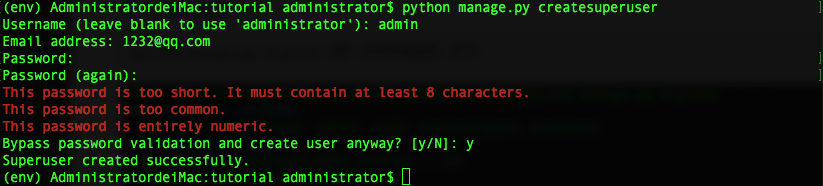
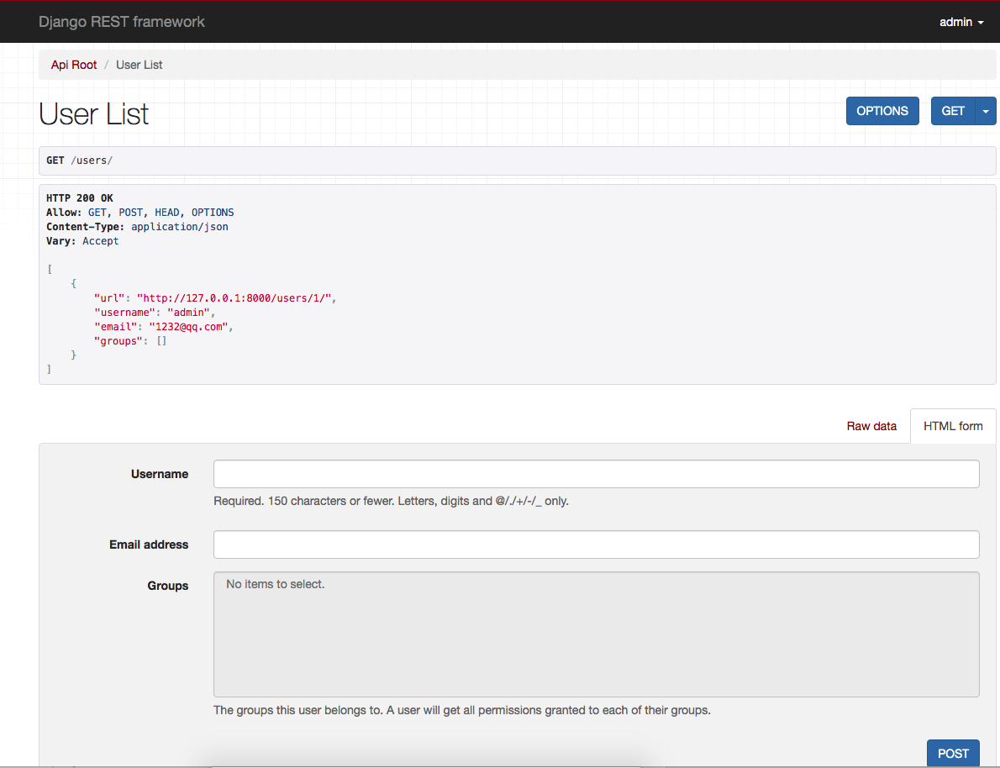
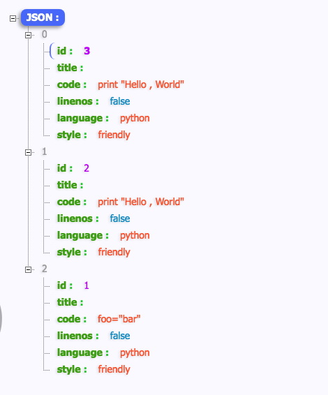
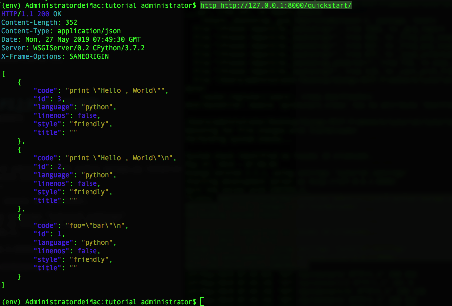

Django-REST-framework使用技巧(一)

* [1.Quickstart](#1)
	* [1.1 项目搭建](#1.1) 
	* [1.2 序列化](#1.2)
	* [1.3 视图](#1.3)
	* [1.4 URLs](#1.4)
	* [1.5 设置](#1.5)
* [2.Serialization](#2)
	* [2.1 创建一个模型](#2.1)
	* [2.2 创建一个序列化类](#2.2) 
	* [2.3 使用Serializers](#2.3)
	* [2.4 使用ModelSerializers](#2.4)
	* [2.5 使用Serializer编写常规的Django视图](#2.5) 
* [3.测试我们在Web API上的第一次访问](#3)


<h1 id='1'></h1>

# 1、Quickstart

## 环境
> Python 3.7.2
> 
> MacOS High Sierra
> 
> django-2.2.1 
> 
> djangorestframework-3.9.4

<h3 id = '1.1'></h3>

## 1.1 项目 
我们将创建一个简单的API来允许管理员用户查看和编辑和系统中的用户和组。

### 项目创建

创建目录

	mkdir tutorial
	cd tutorial
创建virtualenv，环境隔离我们本地的依赖包关系

	virtualenv env # 会得到下面结果回应
```
	Using base prefix '/usr/local/Cellar/python/3.7.2_2/Frameworks/Python.framework/Versions/3.7'
New python executable in /Users/administrator/Desktop/Django-REST-Framework/tutorial/env/bin/python3.7
Also creating executable in /Users/administrator/Desktop/Django-REST-Framework/tutorial/env/bin/python
Installing setuptools, pip, wheel...
done.
```
	source env/bin/activate #激活虚拟环境，可以看到以下结果显示
	(env) AdministratordeiMac:tutorial administrator$ 

在虚拟环境安装Django 和 Django REST Framework
	
	pip install --upgrade pip #先升级pip
	pip install django # 安装django
	pip install djangorestframework # 安装djangorestframework
	pip install pygments #代码高亮
创建项目，并建立一个app

	django-admin startproject tutorial . #建立Django项目。后面"."表示在当前文件夹建立项目
	python manage.py startapp quickstart 或则django-admin.py startapp quickstart #新建一个APP

项目布局应该如下：




第一次同步数据库

	python manage.py migrate #第一次同步数据库，如下：
	


创建超级用户，用户名admin，密码123456(超级用户随便起，但是要记住名字和密码，后面要用到)
	
	python manage.py createsuperuser



<h3 id='1.2'></h3>

## 1.2 序列化

首先定义一些序列化器，创建一个名为tutorial/quickstart/serializers.py的文件，我们将用它来表示数据。

```
#文件路径tutorial/quickstart/serializers.py

from django.contrib.auth.models import User, Group
from rest_framework import serializers


class UserSerializer(serializers.HyperlinkedModelSerializer):
    class Meta:
        model = User
        fields = ('url', 'username', 'email', 'group')
        

class GroupSerializer(serializers.HyperlinkedModelSerializer):
    class Meta:
        model = Group
        field = ('url', 'name')

```
>注意这里，我们使用了超链接关系（HyperlinkedModelSerializer）。你还可以使用主键和其他关系，但是这种超媒体引
>擎驱动是不是很棒的RESTful设计呢。

<h3 id='1.3'></h3>

## 1.3 视图
在tutorial/quickstart/views.py中，输入：

```
#文件路径tutorial/quickstart/views.py

from rest_framework import viewsets
from .serializers import UserSerializer, GroupSerializer
from django.contrib.auth.models import User, Group


class UserViewSet(viewsets.ModelViewSet):

    # 允许用户查看或者编辑API端点

    queryset = User.objects.all().order_by('-date_joined')
    serializer_class = UserSerializer


class GroupViewSet(viewsets.ModelViewSet):
    
    # 允许组查看或者编辑API端点

    queryset = Group.objects.all()
    serializer_class = GroupSerializer
```
>我们将所有通用行为分组到`ViewSets`类中，而不是编写多个视图。
>如果需要，我们可以轻松第将这些视图分解为单个视图（这个后面会细说的），但是使用视图集可以使视图逻辑组织的非常好,
>并且非常简洁。


<h3 id='1.4'></h3>

## 1.4 URLs

配置路由

```
# tutorial/urls.py

from django.contrib import admin
from django.urls import path
from django.conf.urls import url, include
from rest_framework import routers
from quickstart import views


router = routers.DefaultRouter()

router.register('users', views.UserViewSet)
router.register('group', views.GroupViewSet)

# 使用自动URL路由连接API
# 另外，我们还包括可以浏览API的登录URL
urlpatterns = [
    path('admin/', admin.site.urls),
    url('^', include(router.urls)),
    url('^api-auth/', include('rest_framework', namespace='rest_framework')),
]

```

> 因为我们使用视图集而不是视图，所以我们可以通过简单地向路由器类注册视图集，来自动为我们的API生成URL conf。
> 同样，如果我们需要更多地控制API URL，我们可以简单地使用常规的基于类的视图，并明确地编写URL conf。
> 最后，我们将包括默认的和注销视图，以用于可以浏览的API，这是可选的。但是如果你的API需要身份验证，并且想使用可浏览的API，则会很有用。


<h3 id='1.5'></h3>

## 1.5 设置（Setting)

将rest_framework 添加到INSTALLED_APPS.

```
设置路径：tutorial/setting.py中:

INSTALLED_APPS = [
    'django.contrib.admin',
    'django.contrib.auth',
    'django.contrib.contenttypes',
    'django.contrib.sessions',
    'django.contrib.messages',
    'django.contrib.staticfiles',
    'rest_framework',
    
]
```
第一阶段已经完成，下面测一下我们的API：开启服务

	python manage.py runserver

我们可以使用从命令行curl等工具访问我们api：

```
(env) AdministratordeiMac:tutorial administrator$ curl -H 'Accept: application/son; indent=4' -u admin:123456 http://127.0.0.1:8000/users/

[
    {
        "url": "http://127.0.0.1:8000/users/1/",
        "username": "admin",
        "email": "1232@qq.com",
        "groups": []
    }
]
```

或者命令行工具 httpie ...

```
(env) AdministratordeiMac:tutorial administrator$ http -a admin:123456http://127.0.0.1:8000/users/

HTTP 200 OK
Allow: GET, POST, HEAD, OPTIONS
Content-Type: application/json
Vary: Accept

[
    {
        "url": "http://127.0.0.1:8000/users/1/",
        "username": "admin",
        "email": "1232@qq.com",
        "groups": []
    }
]

```

或者直接通过浏览器访问 URL http://127.0.0.1:8000/users/ ，如下如所示：



<h1 id='2'>2、Serialization(序列化)</h1>

添加上文创建APP quickstart

在tutorial/setting.py中:

```
INSTALLED_APPS = [
    'django.contrib.admin',
    'django.contrib.auth',
    'django.contrib.contenttypes',
    'django.contrib.sessions',
    'django.contrib.messages',
    'django.contrib.staticfiles',
    'rest_framework',
    'quickstart',
]
```

<h3 id='2.1'></h3>

## 2.1 创建一个模型
在quickstart/models.py文件中添加模型

```
from django.db import models
from pygments.lexers import get_all_lexers
from pygments.styles import get_all_styles


# 提取出pyment 支持的所有语言的语法分析程序
LEXERS = [item for item in get_all_lexers() if item[1]]

# 提取除了'pyments' 支持的所有语言列表
LANGUAGE_CHOICES = sorted([(item[1][0], item[0]) for item in LEXERS])

# 提取出'pyment' 支持的所有格式化风格列表
STYLE_CHOICES = sorted((item, item) for item in get_all_styles())


class Snippet(models.Model):

    created = models.DateTimeField(auto_now_add=True)
    title = models.CharField(max_length=100, blank=True, default='')
    code = models.TextField()
    linenos = models.BooleanField(default=False)  # 是否显示行号
    language = models.CharField(choices=LANGUAGE_CHOICES, default='python', max_length=120)
    style = models.CharField(choices=STYLE_CHOICES, default='friendly', max_length=120)

    class Meta:
        ordering = ('-created',)

```
然后执行数据迁移和同步

	python manage.py makemigrations
	
	Migrations for 'quickstart':
  	quickstart/migrations/0001_initial.py
    - Create model Snippet

    
	python manage.py migrate
	
	Operations to perform:
  	Apply all migrations: admin, auth, contenttypes, quickstart, sessions
	Running migrations:
  	Applying quickstart.0001_initial... OK
  	
<h3 id='2.2'></h3>
  	
## 2.2 创建一个序列化类

我们开始使用Web API 的第一件事就是提供一种，将代码片段的实例序列化或者反序列化为表示形式（json等）的方法。我们可以通过声明与Django forms非常相似的序列化器（serializers）实现。在上面我们已经创建了serializers.py的文件，现在修改如下：

```
	# 路径quickstart/serializers.py 

from rest_framework import serializers
from .models import Snippet, LANGUAGE_CHOICES, STYLE_CHOICES


class SnippetSerializer(serializers.Serializer):
    id = serializers.IntegerField(read_only=True)
    title = serializers.CharField(required=False, allow_blank=True, max_length=120)
    code = serializers.CharField(style={'base_template': 'textarea.html'})
    linenos = serializers.BooleanField(required=False)
    language = serializers.ChoiceField(choices=LANGUAGE_CHOICES, default="python")
    style = serializers.ChoiceField(choices=STYLE_CHOICES, default='friendly')

    def create(self, validated_data):

        # 给定验证过的数据创建并返回一个新的Snippet实例。
        return Snippet.objects.create(**validated_data)

    def update(self, instance, validated_data):

        # 根据已验证的数据更新并返回已经存在的Snippet实例

        instance.title = validated_data.get('title', instance.title)
        instance.code = validated_data.get('code', instance.code)
        instance.linenos = validated_data.get('linenos', instance.linenos)
        instance.language = validated_data.get('language', instance.language)
        instance.style = validated_data.get('style', instance.style)
        instance.save()
        return instance
```

> 序列化器列的第一部分定义了获得序列化/反序列化的字段。`create()` 和 `update()`方法定义了在调用`serializer.save()`时如何创建和修改完整的实例。
> 
> 序列化器列与Django form类非常类似，在各种字段中，包含类似验证标志，例如`require`,`max_length`和`default`
> 
> 字段标识还可以控制serializer在某些情况下如何显示，比如渲染HTML时候，上面`{'base_template':'textarea.html'}`,标志等同于在Django Form类中使用`widget=widget.Textarea`.这对于控制如何显示可以浏览的API 特别有用，我们将在后面讲解看到。
> 
> 我们实际上也可以通过使用`ModelSerializer`类来节省一些时间，我们稍后会看到，但是现在我们将使用我们明确定义的serializer。


<h3 id='2.3'></h3>

## 2.3 使用Serializers

再进一步了解之间，我们先熟悉使用我们的新类Serializer类。让我们进入Django sehll
	
	python manage.py shell

	
我们已经导入了几个模块，然后开始创建一些片段代码来处理

```
AdministratordeiMac:tutorial administrator$ python manage.py shell
Python 3.7.2 (default, Feb 12 2019, 08:16:38) 
[Clang 10.0.0 (clang-1000.11.45.5)] on darwin
Type "help", "copyright", "credits" or "license" for more information.
(InteractiveConsole)

>>> from quickstart.models import Snippet
>>> from quickstart.serializers import SnippetSerializer
>>> from rest_framework.renderers import JSONRenderer
>>> from rest_framework.parsers import JSONParser
>>> 
>>> snippet = Snippet(code='foo="bar"\n')
>>> snippet.save()
>>> 
>>> snippet = Snippet(code='print "Hello , World"\n')
>>> snippet.save()
```
我们已经有几个可以使用的片段实例，让我们看看序列化中的一个实例：

```
>>> serializer = SnippetSerializer(snippet)
>>> serializer.data
{'id': 2, 'title': '', 'code': 'print "Hello , World"\n', 'linenos': False, 'language': 'python', 'style': 'friendly'}
>>> 
```
此时，我们将模型实例转换成为python原生数据类型。要完成序列化过程，我们将数据渲染成`json`

```
>>> content = JSONRenderer().render(serializer.data)
>>> content
b'{"id":2,"title":"","code":"print \\"Hello , World\\"\\n","linenos":false,"language":"python","style":"friendly"}'
>>> 
```

反序列化是类似的。首先我们将一个流解析为python原生的数据类型：

```
>>> from django.utils.six import BytesIO
>>> 
>>> stream = BytesIO(content)
>>> data = JSONParser().parse(stream)
>>> data
{'id': 2, 'title': '', 'code': 'print "Hello , World"\n', 'linenos': False, 'language': 'python', 'style': 'friendly'}
>>> 
```

然后我们将这些原生的数据类型恢复正常的对象实例。

```
>>> serializer = SnippetSerializer(data=data)
>>> serializer.is_valid()
True
>>> serializer.validated_data
OrderedDict([('title', ''), ('code', 'print "Hello , World"'), ('linenos', False), ('language', 'python'), ('style', 'friendly')])
>>> serializer.save()
<Snippet: Snippet object (3)>
```

注意API工作形式和表单（form）是多么相似。但我们开始使用我门的序列化类编写视图的时候，相似性将会更加明显。
我们也可以**序列化**查询**集**代替**模型实例**。为此，我们只需要在序列化参数中添加一个`mangy = True`

```
>>> serializer = SnippetSerializer(Snippet.objects.all(),many = True)
>>> serializer.data
[OrderedDict([('id', 3), ('title', ''), ('code', 'print "Hello , World"'), ('linenos', False), 
('language', 'python'), ('style', 'friendly')]), OrderedDict([('id', 2), ('title', ''), 
('code', 'print "Hello , World"\n'), ('linenos', False), ('language', 'python'), ('style', 
'friendly')]), OrderedDict([('id', 1), ('title', ''), ('code', 'foo="bar"\n'), ('linenos', 
False), ('language', 'python'), ('style', 'friendly')])]
>>> 
```

<h3 id='2.4'></h3>
## 2.4 使用ModelSerializers
我们在`SnippetSerializer`类中重复包含`Snippet`模型中的信息。如果能保持代码简洁，就像大家经常说的***don't repeat yourself。***就像Django 提供了`Form`类和`MoldelForm`类一样，`RESTFramework`包括`Serializer`类和`ModelSerializers`类一样。我们试着看看使用`ModelSerializer`类重构我们的序列化类。再次打开quickstrat/是、serializers类。并将SnippetSerializer类的内容替换为下面内容：
以前的SnippetSerializer类的内容：

````
from rest_framework import serializers
from .models import Snippet, LANGUAGE_CHOICES, STYLE_CHOICES


class SnippetSerializer(serializers.Serializer):
    id = serializers.IntegerField(read_only=True)
    title = serializers.CharField(required=False, allow_blank=True, max_length=120)
    code = serializers.CharField(style={'base_template': 'textarea.html'})
    linenos = serializers.BooleanField(required=False)
    language = serializers.ChoiceField(choices=LANGUAGE_CHOICES, default="python")
    style = serializers.ChoiceField(choices=STYLE_CHOICES, default='friendly')

    def create(self, validated_data):

        # 给定验证过的数据创建并返回一个新的Snippet实例。
        return Snippet.objects.create(**validated_data)

    def update(self, instance, validated_data):

        # 根据已验证的数据更新并返回已经存在的Snippet实例

        instance.title = validated_data.get('title', instance.title)
        instance.code = validated_data.get('code', instance.code)
        instance.linenos = validated_data.get('linenos', instance.linenos)
        instance.language = validated_data.get('language', instance.language)
        instance.style = validated_data.get('style', instance.style)
        instance.save()
        return instance
````
替换如下：

```
from rest_framework import serializers
from .models import Snippet

class SnippetSerializer(serializers.ModelSerializer):
    class Meta:
        model = Snippet
        fields = ('id', 'title', 'code', 'linenos', 'language', 'style')

```
序列化程序有一个非常棒的属性，就是可以通过打印其结构（representation）来检查序列化实例中的所有字段。

```
>>> from quickstart.serializers import SnippetSerializer
>>> serialzier = SnippetSerializer()
>>> print(repr(serializer))
SnippetSerializer(<QuerySet [<Snippet: Snippet object (3)>, <Snippet: Snippet object (2)>, <Snippet: Snippet object (1)>]>, many=True):
    id = IntegerField(read_only=True)
    title = CharField(allow_blank=True, max_length=120, required=False)
    code = CharField(style={'base_template': 'textarea.html'})
    linenos = BooleanField(required=False)
    language = ChoiceField(choices=[('abap', 'ABAP'), ('abnf', 'ABNF'), ('ada', 'Ada'), ('adl', 'ADL'), ('agda', 'Agda'), .... ('zephir', 'Zephir')], default='python')
    style = ChoiceField(choices=[('abap', 'abap'),.... ('trac', 'trac'), ('vim', 'vim'), ('vs', 'vs'), ('xcode', 'xcode')], default='friendly')
>>> 
```

注意`ModelSerializer`类并不会做任何特别神奇的事情，他们只是创建序列化器类的快捷方式：

* 自动确定一组字段（不用重复去定义类属性）。
* 默认简单的实现`create()`和`update()`方法。

<h3 id='2.5'></h3>
## 2.5 使用我们的Serializer编写常规的Django视图

我们尝试使用我们的Serializer类编写一些API视图。目前我们不用任何REST Framework 的其他功能，我么只编写常规的Django视图。

```
路径 ： quickstart/view.py，下面是我们开始写的内容
from rest_framework import viewsets
from .serializers import UserSerializer, GroupSerializer
from django.contrib.auth.models import User, Group


class UserViewSet(viewsets.ModelViewSet):

    # 允许用户查看或者编辑API端点

    queryset = User.objects.all().order_by('-date_joined')
    serializer_class = UserSerializer


class GroupViewSet(viewsets.ModelViewSet):

    # 允许组查看或者编辑API端点

    queryset = Group.objects.all()
    serializer_class = GroupSerializer

```
然后替换如下：

```

quickstart/view.py #

from django.http import HttpResponse,JsonResponse
from django.views.decorators.csrf import csrf_exempt
from rest_framework.renderers import JSONRenderer
from rest_framework.parsers import JSONParser
from quickstart.models import Snippet
from quickstart.serializers import SnippetSerializer


@csrf_exempt
def snippet_list(request):
    # 列出所有代码 snippet， 或者创建一个新的snippet

    if request.method == 'GET':
        snippets = Snippet.objects.all()
        serializer = SnippetSerializer(snippets, many=True)
        return JsonResponse(serializer.data, safe=False)
    elif request.method == 'POST':
        data = JSONParser().parse(request)
        serializer = SnippetSerializer(data=data)
        if serializer.is_valid():
            serializer.save()
            return JsonResponse(serializer.data, status=201)

    return JsonResponse(serializer.errors, status=400)
```
注意，因为我们希望能够从不具有CSRF令牌的客户端POST到此视图，所以我们需要将该视图标记为@csrf_exempt.这不是你通常想要做的事情，并且RESTframework视图实际上比这更具实用行为，但是他现在足够达到我们的目的。
我们还需要一个与单个相对应的视图，并可用于检索、更新或者删除snippet.

```
quickstart/view.py #

@csrf_exempt
def snippet_detail(request, pk):
    # 获取、更新或者删除一个代码 snippet

    try:
        snippet = Snippet.objects.get(pk=pk)
    except Snippet.DoesNotExist:
        return HttpResponse(status=404)
    
    if request.method == 'GET':
        serializer = SnippetSerializer(snippet)
        return JsonResponse(serializer.data)
    
    elif request.method == 'PUT':
        data = JSONParser().parse(request)
        serializer = SnippetSerializer(snippet, data=data)
        if serializer.is_valid():
            serializer.save()
            return JsonResponse(serializer.data)
        return JsonResponse(serializer.errors, status=400)
    
    elif request.method == 'DELETE':
        snippet.delete()
        return HttpResponse(status=204)
```
 
最后，我们需要把这些驶入链接起来，创建quickstart/urls.py 文件

```

from django.conf.urls import url
from .views import snippet_list, snippet_detail

urlpatterns = [
    url('^quickstart/$', snippet_list),
    url('^quickstart/(?P<pk>[0-9]+)/$', snippet_detail),
]

```

另外需要在tutorial/urls.py中吧root urlconf来包含我们的quickstart应用的urls。修改为下面内容：

```
from django.contrib import admin
from django.urls import path
from django.conf.urls import url, include

urlpatterns = [
    path('admin/', admin.site.urls),
    url('^', include('quickstart.urls')),
]
```

<h3 id='3'></h3>
#3. 测试我们在Web API上的第一次访问
启动quickstart服务，我们先退出shell
	
	quit()
启动Django开发服务
	
```
AdministratordeiMac:tutorial administrator$ python manage.py runserver
Watching for file changes with StatReloader
Performing system checks...

System check identified no issues (0 silenced).
May 27, 2019 - 07:13:55
Django version 2.2.1, using settings 'tutorial.settings'
Starting development server at http://127.0.0.1:8000/
Quit the server with CONTROL-C.
```
在浏览器中输入`http://127.0.0.1:8000/quickstart/`



或者安装httpie
	
	pip install httpie

然后在终端输入：`http http://127.0.0.1:8000/quickstart/`,如下



Django-REST-framework使用技巧(二)

* [1.请求和响应](#1)
* [2.基于类的视图](#2)
* [3.认证和权限](#3)

Django-REST-framework使用技巧(三)

* [1. 关系和超链接 API（Relationships & hyperlinked APIs）](#1)
* [2. 视图集合和路由（ViewSets ＆ Routers）](#2)
* [3. 架构和客户端库(Schemas & client libraries)](#3)